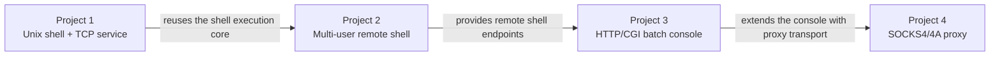

# Network Programming Systems Portfolio

A four-project systems programming portfolio built for a Spring 2026 Network Programming course. The projects progress from a Unix-like shell to multi-user network services, an asynchronous HTTP/CGI console, and a SOCKS4/4A proxy.

The work focuses on process management, file-descriptor ownership, TCP server design, inter-process communication, asynchronous I/O, application-layer protocols, and reliability testing in C++.

> The reviewable source code is included directly under [`projects/`](projects/). No access to the original private GitHub Classroom repositories is required.

## Portfolio at a Glance

| Project | System | Main engineering topics | Source |
| --- | --- | --- | --- |
| 1 | NPShell and concurrent TCP shell server | `fork`/`exec`, ordinary and numbered pipes, redirection, environment isolation, socket-to-stdio bridging | [Browse Project 1](projects/01-npshell/) |
| 2 | Remote Working Ground multi-user shell | `select`-based concurrency, process-per-client design, shared memory, signals, FIFO-based user pipes | [Browse Project 2](projects/02-rwg-server/) |
| 3 | HTTP server and web-based remote console | Boost.Asio, HTTP parsing, CGI execution, asynchronous DNS/TCP, concurrent browser streaming | [Browse Project 3](projects/03-http-cgi-console/) |
| 4 | SOCKS4/4A proxy and proxied CGI console | CONNECT/BIND, SOCKS4A domain resolution, dynamic firewall rules, bidirectional relay, protocol tests | [Browse Project 4](projects/04-socks-proxy/) |

## System Progression



## Engineering Highlights

- Designed explicit file-descriptor routing for stdin, stdout, stderr, ordinary pipes, delayed numbered pipes, files, sockets, and cross-user pipes.
- Implemented two multi-user server architectures for the same behavior: one event-driven process using `select`, and one process per client using shared memory, signals, and named FIFOs.
- Built asynchronous HTTP and remote-console workflows with Boost.Asio, including DNS resolution, connection management, incremental reads, ordered command dispatch, and streamed browser updates.
- Implemented SOCKS4/4A request parsing, CONNECT and two-reply BIND flows, wildcard firewall rules reloaded per request, and full-duplex TCP relay.
- Added focused C++ component tests and Python integration tests for fragmented TCP prompts, HTTP/CGI behavior, concurrent remote sessions, SOCKS relay, BIND, and firewall reload.

## Project Details

### [Project 1 — NPShell and Concurrent TCP Server](projects/01-npshell/)

Project 1 implements a Unix-like command interpreter and exposes the same shell over TCP.

Core behavior:

- Executes external commands through `fork`, `execvp`, and `waitpid`.
- Supports ordinary pipes (`|`), stdout numbered pipes (`|N`), stdout-and-stderr numbered pipes (`!N`), and file redirection (`>`).
- Merges multiple producers targeting the same future numbered pipe.
- Provides `setenv`, `printenv`, and `exit` built-ins.
- Reaps completed child processes and separates per-connection shell state.
- Uses a process-per-client TCP server; `dup2` maps the accepted socket to stdin, stdout, and stderr.

Key design choice: reusable shell behavior lives in `shell_core.h`, while `npshell.cpp` and `np_simple.cpp` remain thin local and network entry points.

### [Project 2 — Multi-User Remote Working Ground Server](projects/02-rwg-server/)

Project 2 extends the shell into a chat-like remote working environment for up to 30 users.

Shared behavior:

- Preserves all Project 1 shell, pipe, redirection, and environment features.
- Adds `who`, `name`, `tell`, and `yell` built-ins.
- Broadcasts login, logout, rename, and user-pipe events.
- Transfers command output between users with `>N` and consumes it with `<N`.
- Rejects nonexistent users, duplicate names, missing pipes, and duplicate pipes with explicit messages.

Two concurrency models are implemented:

1. `np_single_proc.cpp` multiplexes the listening socket and every client socket with `select`; users and anonymous user pipes stay in one process.
2. `np_multi_proc.cpp` forks one process per client; System V shared memory stores the user registry and message queues, `SIGUSR1` triggers message delivery, and named FIFOs carry user-pipe data.

### [Project 3 — Asynchronous HTTP/CGI Remote Console](projects/03-http-cgi-console/)

Project 3 provides a browser interface that drives up to five remote shell sessions concurrently.

- `http_server` asynchronously accepts and parses HTTP requests, prepares CGI environment variables, maps the client socket to CGI output, and executes the allowed CGI program in a child process.
- `console.cgi` parses session parameters from `QUERY_STRING`, connects to remote shell servers asynchronously, waits for each `% ` prompt, and sends the next command from the selected test file.
- Browser output is streamed as escaped JavaScript updates so commands and server responses remain ordered and visibly distinct.
- `cgi_server.exe` integrates the HTTP server, panel page, and remote console into one event-driven process for the course's Windows target.
- Shared parsing, rendering, and remote-session logic is centralized in `console_components.cpp/.hpp`.

The reliability suite exercises HTTP status handling, CGI environment propagation, fragmented TCP reads, multiple concurrent sessions, randomized command batches, and integration with the course-provided remote shell server.

### [Project 4 — SOCKS4/4A Proxy and CGI Client](projects/04-socks-proxy/)

Project 4 adds a proxy layer between the web console and remote shell servers.

- Parses SOCKS4 requests and SOCKS4A domain names.
- Supports CONNECT and BIND, including the two replies required by BIND before relaying traffic.
- Resolves SOCKS4A destinations through Boost.Asio and rejects unsupported versions or commands.
- Applies command-specific IPv4 wildcard rules from `socks.conf`; the file is loaded for every request so rules can change without a server restart.
- Forks a child for each SOCKS client and relays traffic in both directions.
- Extends the Project 3 CGI console with `sh` and `sp` query parameters and a SOCKS4A handshake.
- Handles a shell prompt split across separate TCP reads.

The repository includes automated CONNECT, BIND, firewall-reload, and proxied-CGI tests, plus a manual report covering Firefox CONNECT, active-mode FTP BIND, and CGI-through-SOCKS scenarios.

## Build and Run

### Requirements

- Linux or another POSIX environment for the complete project set
- C++14 or newer; Project 4 uses C++17
- GNU Make
- Boost.Asio and `boost_system` for Projects 3 and 4 (the course environment used Boost 1.81)
- Python 3 for integration tests and the provided CGI panels
- A TCP client such as `telnet` or `nc` for shell-server demonstrations

Project 2 relies on Linux/POSIX facilities such as `clearenv`, System V shared memory, signals, and named FIFOs. Build outputs are intentionally excluded from this portfolio and should be produced on the target platform.

### Project 1

```bash
cd projects/01-npshell
make all

./npshell
./np_simple 7001
telnet 127.0.0.1 7001
```

### Project 2

```bash
cd projects/02-rwg-server
make all

./np_single_proc 7001
# or
./np_multi_proc 7001
```

Open two or more terminals and connect each client with `telnet 127.0.0.1 7001` to exercise chat commands and user pipes.

### Project 3

```bash
cd projects/03-http-cgi-console
make part1       # http_server and console.cgi
make part2       # cgi_server.exe
make tests       # test_components

./test_components
python3 tests/run_reliability_suite.py
```

For the integrated panel-to-console flow, run `./cgi_server.exe 7001` and open `http://127.0.0.1:7001/panel.cgi`. The standalone `http_server` demonstrates the Linux fork/exec CGI path and currently applies an explicit CGI allowlist.

### Project 4

```bash
cd projects/04-socks-proxy
make

./socks_server 7001
```

Run the repository-level automated suite from a Linux workspace where `socks_server`, `pj4.cgi`, `socks.conf`, and `test_case/` are in the expected locations:

```bash
python3 test_socks_server.py
```

## Source and Artifact Guide

The public snapshot contains implementation, build, configuration, and test files. Private Git metadata, course specifications, provided binaries, presentation files, archives, and generated objects are intentionally excluded. See [`projects/README.md`](projects/README.md) for the snapshot policy.

<details>
<summary><strong>projects/01-npshell — NPShell</strong></summary>

| File | Purpose |
| --- | --- |
| [`Makefile`](projects/01-npshell/Makefile) | Builds `npshell`, `np_simple`, helper commands, and copied `ls`/`cat` executables. |
| [`npshell.cpp`](projects/01-npshell/npshell.cpp) | Local shell entry point and `SIGCHLD` registration. |
| [`np_simple.cpp`](projects/01-npshell/np_simple.cpp) | IPv4 TCP listener and process-per-client shell adapter. |
| [`shell_core.h`](projects/01-npshell/shell_core.h) | Parser, built-ins, environment handling, child lifecycle, FD cleanup, ordinary pipes, numbered pipes, and redirection. |
| [`commands/noop.cpp`](projects/01-npshell/commands/noop.cpp) | No-output command used in pipeline tests. |
| [`commands/number.cpp`](projects/01-npshell/commands/number.cpp) | Line-numbering filter for files or stdin. |
| [`commands/removetag.cpp`](projects/01-npshell/commands/removetag.cpp) | HTML-like tag-removal filter. |
| [`commands/removetag0.cpp`](projects/01-npshell/commands/removetag0.cpp) | Tag-removal filter with stderr diagnostics. |
| [`test.html`](projects/01-npshell/test.html) | Shared command and pipeline fixture. |
| [`.gitignore`](projects/01-npshell/.gitignore) | Excludes generated commands, binaries, tests, scripts, text output, and Markdown. |

</details>

<details>
<summary><strong>projects/02-rwg-server — multi-user shell</strong></summary>

| File | Purpose |
| --- | --- |
| [`Makefile`](projects/02-rwg-server/Makefile) | Detects available parts and builds the shell, TCP servers, and helper commands. |
| [`np_single_proc.cpp`](projects/02-rwg-server/np_single_proc.cpp) | Single-process `select` server, in-memory user registry, chat built-ins, and anonymous-pipe user channels. |
| [`np_multi_proc.cpp`](projects/02-rwg-server/np_multi_proc.cpp) | Process-per-client server using shared memory, a spin lock, signal-triggered message queues, and FIFO user pipes. |
| [`shell_core.h`](projects/02-rwg-server/shell_core.h) | Generalized Project 1 execution engine with per-user environment state and injectable input/output/error FDs. |
| [`npshell.cpp`](projects/02-rwg-server/npshell.cpp) | Local shell adapter retained from Project 1. |
| [`np_simple.cpp`](projects/02-rwg-server/np_simple.cpp) | Simple process-per-client shell server retained from Project 1. |
| [`commands/`](projects/02-rwg-server/commands/) | `noop`, `number`, `removetag`, and `removetag0` shell test programs. |
| [`np_project_2_demo.html`](projects/02-rwg-server/np_project_2_demo.html) | Static two-terminal walkthrough of chat commands and cross-user pipes. |
| [`.gitignore`](projects/02-rwg-server/.gitignore) | Excludes generated executables and local test artifacts. |

</details>

<details>
<summary><strong>projects/03-http-cgi-console — HTTP/CGI console</strong></summary>

| File | Purpose |
| --- | --- |
| [`Makefile`](projects/03-http-cgi-console/Makefile) | Builds Linux `http_server`/`console.cgi`, integrated `cgi_server.exe`, and component tests. |
| [`http_server.cpp`](projects/03-http-cgi-console/http_server.cpp) | Async HTTP listener, request collection, CGI environment setup, fork/exec handling, and response errors. |
| [`console.cpp`](projects/03-http-cgi-console/console.cpp) | Standalone CGI entry point for parallel remote shell sessions. |
| [`cgi_server.cpp`](projects/03-http-cgi-console/cgi_server.cpp) | Integrated HTTP panel and console server with serialized browser writes. |
| [`console_components.hpp`](projects/03-http-cgi-console/console_components.hpp) | Shared request/session data types and `RemoteBatchSession` interface. |
| [`console_components.cpp`](projects/03-http-cgi-console/console_components.cpp) | URL/query parsing, HTML/JavaScript escaping, page generation, command loading, and async remote-session implementation. |
| [`tests/test_components.cpp`](projects/03-http-cgi-console/tests/test_components.cpp) | Focused tests for request parsing, URL decoding, session selection, escaping, and page rendering. |
| [`tests/run_reliability_suite.py`](projects/03-http-cgi-console/tests/run_reliability_suite.py) | HTTP, CGI, concurrency, fragmentation, randomized, and golden-server integration suite. The full integration run requires the excluded course fixtures. |
| [`.gitignore`](projects/03-http-cgi-console/.gitignore) | Separates source from build outputs, local notes, editor files, and provided runtime fixtures. |

</details>

<details>
<summary><strong>projects/04-socks-proxy — SOCKS proxy</strong></summary>

| File | Purpose |
| --- | --- |
| [`Makefile`](projects/04-socks-proxy/Makefile) | Builds `socks_server` and `pj4.cgi` with C++17 and Boost.Asio. |
| [`socks_server.cpp`](projects/04-socks-proxy/socks_server.cpp) | SOCKS4/4A parser, DNS resolution, per-request firewall loading, CONNECT/BIND handling, process isolation, session-duration policy, and bidirectional relay. |
| [`console_components.hpp`](projects/04-socks-proxy/console_components.hpp) | Header-only remote console plus SOCKS4A transport, escaping, query parsing, and split-prompt handling. |
| [`pj4.cpp`](projects/04-socks-proxy/pj4.cpp) | CGI entry point that runs up to five remote sessions through the configured SOCKS server. |
| [`console.cpp`](projects/04-socks-proxy/console.cpp) | Direct-connection Project 3 console retained as a comparison/reference implementation. |
| [`test_socks_server.py`](projects/04-socks-proxy/test_socks_server.py) | Integration tests for CONNECT relay, two-stage BIND relay, live firewall reload, and CGI proxy prompt fragmentation. |
| [`socks.conf`](projects/04-socks-proxy/socks.conf) | Default allow rules for CONNECT and BIND. |
| [`panel_socks.cgi`](projects/04-socks-proxy/panel_socks.cgi) | Python CGI form for five remote sessions plus SOCKS host/port parameters. |
| [`note.md`](projects/04-socks-proxy/note.md) | Manual test report for Firefox, active-mode FTP, CGI proxying, and firewall behavior. |

</details>

## Validation Notes

- Project 1 builds successfully in the current workspace and passes a smoke test covering `printenv` plus `removetag test.html | number`.
- Project 2 is Linux-oriented; on macOS, compilation stops at the Linux `clearenv` API before the server targets are built.
- Projects 3 and 4 require Boost headers and libraries. Their test sources and historical/manual test evidence are included, but a Boost development environment is required to rerun them.
- The PDF specifications are course requirements; implementation claims in this README are based on the source code and included tests rather than the specifications alone.

## Scope and Attribution

The server implementations, reusable execution/session components, protocol handling, and added reliability tests form the portfolio work. Assignment specifications, presentation files, compiled binaries, archives, golden executables, and standalone CGI reference programs are not published in the source snapshots. Small helper-command sources and fixtures required to run the shells are included as course context.

## CV-Ready Summary

> Built a four-stage network systems portfolio in C++: a Unix-like shell with delayed pipes, two multi-user TCP server architectures, an asynchronous Boost.Asio HTTP/CGI remote console, and a SOCKS4/4A proxy supporting CONNECT, BIND, live firewall reload, and automated protocol-level integration tests.
